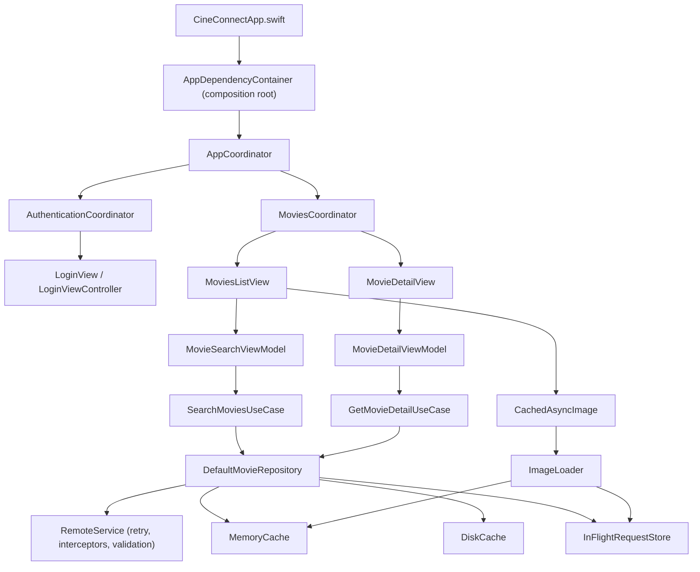

# CineConnect

CineConnect is a SwiftUI movie-browsing app built as an MVVM + Coordinator + Repository reference architecture, backed by a remote catalog. It combines a native list/detail flow with debounced search, an actor-based caching layer, a reusable `URLSession` networking stack, and a UIKit `WKWebView` login screen embedded in SwiftUI.

> The app depends on a third-party streaming service's private web session and endpoints. Those can change without notice. This repository is best reviewed as an architecture, concurrency, and testing sample, not as an official client.

## Engineering highlights

- **MVVM + Coordinator + Repository + DI:** one composition root (`AppDependencyContainer`) builds every dependency; coordinators own navigation; view models expose explicit published state; repositories mediate between use cases and caching/networking.
- **SwiftUI + UIKit interoperability:** `LoginViewController` hosts `WKWebView` and captures the authenticated session; `LoginView` bridges it into the SwiftUI flow.
- **Actor-based caching:** generic `MemoryCache<Key, Value>` (TTL + LRU), `DiskCache<Value>` (Codable-to-disk), and `InFlightRequestStore<Key, Value>` (request coalescing) back both movie data and images through a typed `CachePolicy` (`.networkFirst` / `.cacheFirst` / `.reloadIgnoringCache`).
- **Cached image pipeline:** `ImageLoader` (actor) and `CachedAsyncImage` (SwiftUI view) reuse the same `MemoryCache`/`InFlightRequestStore` primitives built for movie data, instead of relying on `AsyncImage`'s opaque `URLCache`-backed caching.
- **Combine + async/await, each for what it's good at:** a `$searchText.debounce().removeDuplicates().sink` pipeline shapes the keystroke stream; the network call itself is `async/await`, bridged through a cancel-on-new-input `Task`. See [`docs/COMBINE_SEARCH_PIPELINE.md`](docs/COMBINE_SEARCH_PIPELINE.md).
- **Structured networking:** endpoint definitions, request construction, an injected auth-header interceptor, bounded-retry policy, `200..<300` response validation, DTO decoding, and domain mapping are all separated.
- **Keychain-backed credentials:** an actor-based `KeychainStore` behind a `SecureKeyValueStoring` protocol boundary, so tests run against an in-memory fake instead of the real Keychain.
- **Swift 6 strict concurrency:** `SWIFT_STRICT_CONCURRENCY = complete`, zero warnings, actors used only where genuinely justified (documented case by case in `docs/Learning/Architecture/`).
- **Tested without live external services:** `URLProtocol` stubs and fakes stand in for the network and Keychain; 108 tests run fully offline.

## Coordinator: what this app shows and doesn't

This is a **SwiftUI coordinator** example. `AppCoordinator` switches the root between `.auth` and `.movies` using `@Published` state; `AuthenticationCoordinator` owns the login flow; `MoviesCoordinator` supplies a `NavigationStack`, a `NavigationPath`, and a `MoviesRoute` destination enum. Root, authentication, and logout transitions are coordinator-driven, while list → detail navigation is driven by SwiftUI's value-based `navigationDestination`.

That differs from a classic UIKit coordinator built around `UINavigationController`: the coordinator would call `pushViewController`, retain child coordinators in a `childCoordinators` array, remove a child when it calls `childDidFinish`, and usually hold its parent weakly to avoid a retain cycle. This app demonstrates the ownership and flow idea in a SwiftUI-native way, but it is not a UIKit `UINavigationController` coordinator implementation.

## User flow

```text
Web login → session captured → movie search/list → movie detail
```

The list shows movie artwork and summary data. Selecting a movie loads its description, duration, and IMDb rating when those fields are returned by the service.

## Project structure

```text
CineConnect/
├── App/                 AppDependencyContainer — the single composition root
├── Coordinators/        AppCoordinator, AuthenticationCoordinator, MoviesCoordinator, MoviesRoute
├── Domain/
│   ├── Models/          Movie, MovieDetail (Sendable domain models)
│   ├── UseCases/        SearchMoviesUseCase, GetMovieDetailUseCase
│   └── MovieRepository.swift   Repository protocol
├── Data/
│   ├── DTOs/            Wire-format decoding types
│   ├── Mappers/          DTO → domain mapping
│   └── DefaultMovieRepository.swift   Policy-driven cache + network orchestration
├── Caching/              CachePolicy, MemoryCache, DiskCache, InFlightRequestStore, ImageLoader
├── Storage/              KeychainStore, CredentialsStore, WebDataClearingService
├── Services/
│   ├── Remote/           Request, Response, Interceptors, RetryPolicy, RemoteError, RemoteService
│   └── *APIService       Feature-specific endpoints
├── ViewModels/           MovieSearchViewModel, MovieDetailViewModel
├── Views/                SwiftUI screens, Login/ (WKWebView bridge), Components/ (CachedAsyncImage)
└── Utils/                AuthManager, theme/font helpers
```

## Architecture



`DefaultMovieRepository` is policy-driven, not a simple fallback cache: `.cacheFirst` returns a fresh cache hit without touching the network, `.reloadIgnoringCache` always calls through to `RemoteService`, and `.networkFirst` (the default) tries the network and falls back to a stale cache entry on failure. `MemoryCache` and `DiskCache` are generic actors shared by both movie data and, via `ImageLoader`, poster images — there's no separate `MovieCache` type.

## Build and run

1. Open `CineConnect.xcodeproj` in Xcode.
2. Choose an iOS simulator or device compatible with the deployment target in the project.
3. Build and run.
4. Complete the web login if the third-party service still permits the flow.

## Testing

108 tests across two targets, all runnable offline:

- **`CineConnectTests`** — unit tests for coordinators, view models, the repository, every caching actor (`MemoryCache`, `DiskCache`, `InFlightRequestStore`, `ImageLoader`), networking (`RemoteService`, `RetryPolicy`, `RemoteError`), auth (`AuthManager`, `CredentialsStore`, `HotstarCredentialExtractor`), and DTO/mapper correctness. Networking and image loading are exercised against `URLProtocol` stubs (`StubURLProtocol`, `StubImageURLProtocol`); Keychain access is exercised against an in-memory `SecureKeyValueStoring` fake — no live network or Keychain access is required to run the suite.
- **`CineConnectUITests`** — a smoke test driving the running app through accessibility identifiers (`movieSearchResultsList`, `movieRow-<id>`, `movieDetailScreen`, `logoutButton`).

Run from Xcode (`Cmd+U`) or from the command line:

```bash
xcodebuild -project CineConnect.xcodeproj -scheme CineConnect \
  -destination 'platform=iOS Simulator,name=iPhone 17' \
  -configuration Debug CODE_SIGNING_ALLOWED=NO clean test
```

CI runs the same build+test on every push/PR via [`.github/workflows/build-and-test.yml`](.github/workflows/build-and-test.yml), plus a secret scan via [`.github/workflows/secret-scan.yml`](.github/workflows/secret-scan.yml) and [`scripts/check-secrets.sh`](scripts/check-secrets.sh).

## Concurrency approach

The project builds with `SWIFT_STRICT_CONCURRENCY = complete` (Swift 6 checking) and currently compiles with zero concurrency warnings. Actors are used only where genuinely justified — shared mutable cache state (`MemoryCache`, `DiskCache`, `InFlightRequestStore`), Keychain access (`KeychainStore`), credential storage (`CredentialsStore`), and image loading (`ImageLoader`) — not applied reflexively to every type. UI-facing types (`AuthManager`, `MoviesCoordinator`, view models) are `@MainActor` classes instead. See `docs/Learning/Architecture/` for a phase-by-phase rationale, including the specific compiler edge cases hit along the way (actor reentrancy in request coalescing, `nonisolated` conformances under `SWIFT_DEFAULT_ACTOR_ISOLATION = MainActor`, and the `WKNavigationDelegate` main-actor closure signature).

## Learning documentation

This repository doubles as a learning log for the migration from a single-screen sample to this architecture. Start at [`docs/Learning/README.md`](docs/Learning/README.md), which indexes:

- [`docs/Learning/CURRENT_IMPLEMENTATION.md`](docs/Learning/CURRENT_IMPLEMENTATION.md) — current architecture snapshot
- [`docs/Learning/IMPLEMENTATION_JOURNAL.md`](docs/Learning/IMPLEMENTATION_JOURNAL.md) — chronological log of what was built, in what order
- [`docs/Learning/FILE_INDEX.md`](docs/Learning/FILE_INDEX.md) — file-by-file index
- [`docs/Learning/CONCEPT_TO_CODE_MAP.md`](docs/Learning/CONCEPT_TO_CODE_MAP.md) — architectural concept → concrete file/type
- `docs/Learning/Architecture/Phase-01` through `Phase-08` — per-phase before/after, code excerpts, build/test evidence, interview Q&A, and exercises
- [`docs/Learning/Decisions/`](docs/Learning/Decisions/) — standalone architecture decision records
- [`docs/COMBINE_SEARCH_PIPELINE.md`](docs/COMBINE_SEARCH_PIPELINE.md) and [`docs/SWIFTUI_UIKIT_INTEROPERABILITY.md`](docs/SWIFTUI_UIKIT_INTEROPERABILITY.md) — standalone cross-cutting references

## Known limitations

- The app depends on an unofficial, private Hotstar web session; the login flow and endpoints can break without notice (see the disclaimer above).
- Combine's debounce pipeline uses a real injectable interval, not a virtual-time scheduler — short-interval tests are fast but not perfectly immune to scheduling jitter under extreme load (`docs/Learning/Architecture/Phase-07-Combine-and-Cancellation.md` §13).
- `DiskCache` persists only movie detail responses; poster images are cached in memory only (`URLCache` still provides some underlying disk persistence, unconfigured — see `docs/Learning/Architecture/Phase-08-Image-Pipeline.md` §12).
- CI's build/test job was authored and validated locally against the same `xcodebuild` invocation it runs, but has not been observed running inside GitHub Actions from this environment.

## Scope and ownership

This is an independent educational sample. Disney+ Hotstar, IMDb, their marks, media, and services belong to their respective owners. No affiliation or endorsement is claimed.
