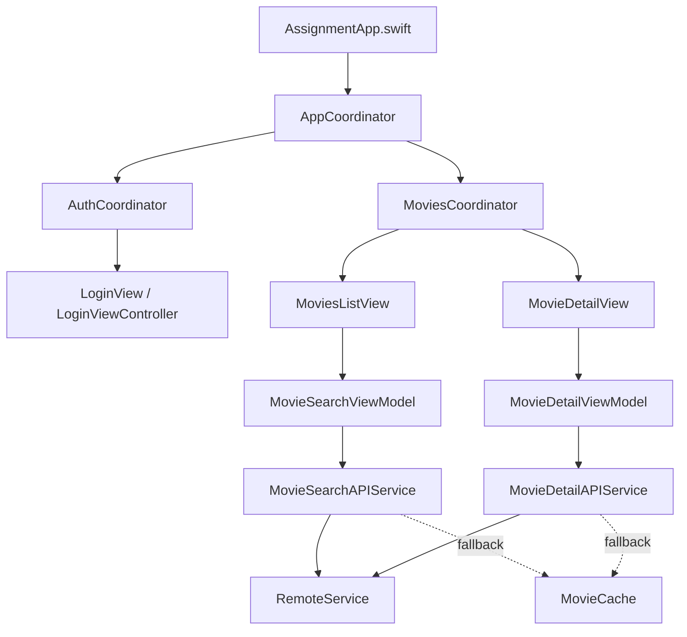

# CineConnect

CineConnect is a SwiftUI movie-browsing sample built around a remote catalog. It combines a native list/detail flow with debounced search, a reusable `URLSession` layer, and a UIKit `WKWebView` login screen embedded in SwiftUI.

> The app depends on a third-party streaming service's private web session and endpoints. Those can change without notice. This repository is best reviewed as an architecture and UI sample, not as an official client.

## Engineering highlights

- **SwiftUI + UIKit interoperability:** `LoginViewController` hosts `WKWebView`; `LoginView` bridges it into the SwiftUI flow.
- **MVVM state flow:** separate search and detail view models own loading, success, and error state.
- **Debounced search:** Combine avoids issuing a request for every keystroke.
- **Structured networking:** endpoint definitions, request construction, interceptors, response validation, DTO decoding, and domain mapping are separated.
- **Async work:** view models coordinate network calls using Swift concurrency.
- **Coordinator-owned navigation:** `AppCoordinator` selects the auth or movies flow, while child coordinators own their feature destinations.
- **Offline-first responses:** successful movie searches and details are persisted as Codable JSON and used when a later network request fails.

## User flow

```text
Web login → session captured → movie search/list → movie detail
```

The list shows movie artwork and summary data. Selecting a movie loads its description, duration, and IMDb rating when those fields are returned by the service.

## Project structure

```text
Assignment/
├── Coordinators/       App, auth, and movies navigation ownership
├── Models/             Domain models and API DTOs
├── Services/
│   ├── Cache/          Codable-to-disk movie response cache
│   ├── Remote/         Request, response, interceptor, and error primitives
│   └── *APIService     Feature-specific endpoints
├── ViewModels/         Search and detail presentation state
├── Views/              SwiftUI screens and WKWebView bridge
└── Utils/              Session state, theme, and font helpers
```

## Architecture



The API services try the existing remote path first, save successful domain responses, and read the matching cached response only when the request fails. The cache is optional and isolated from authentication and navigation state.

## Build and run

1. Open `Assignment.xcodeproj` in Xcode.
2. Choose an iOS simulator or device compatible with the deployment target in the project.
3. Build and run.
4. Complete the web login if the third-party service still permits the flow.

There is no test target yet. The most valuable next tests are request construction, DTO-to-domain mapping, and view-model state transitions with an injected service.

## Scope and ownership

This is an independent educational sample. Disney+ Hotstar, IMDb, their marks, media, and services belong to their respective owners. No affiliation or endorsement is claimed.
