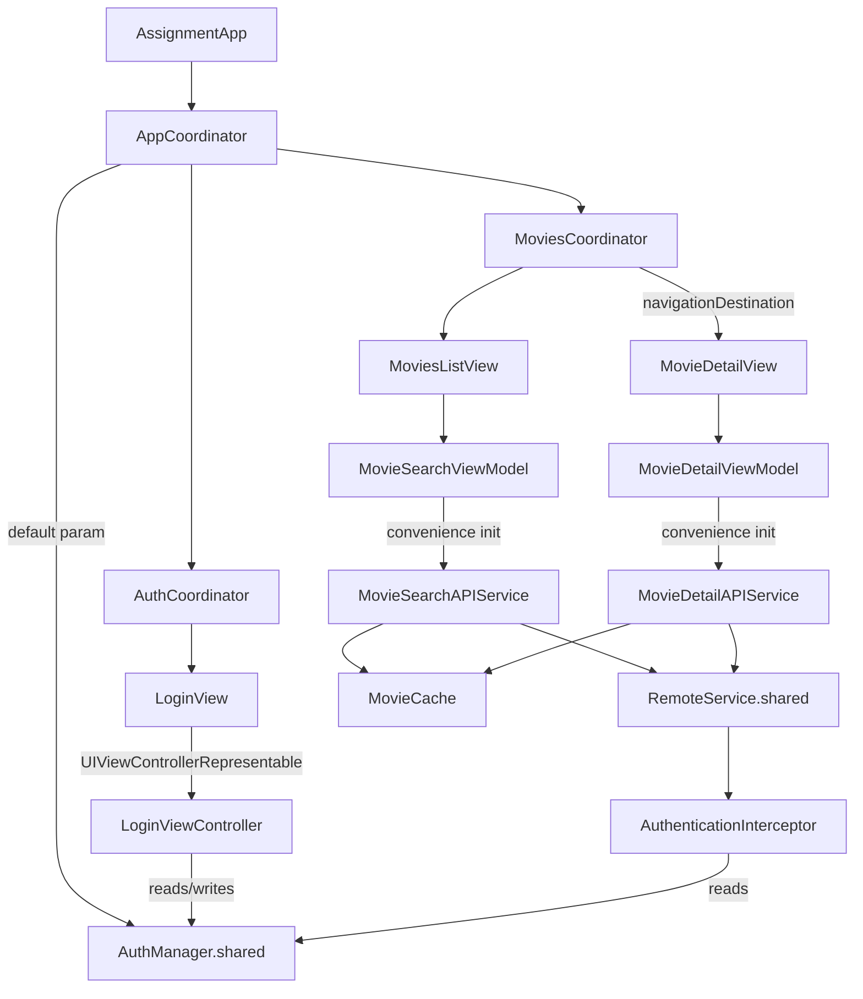

# CineConnect — Architecture Refactor Plan

Status: Phase 0 (baseline audit). Verified against `feature-cineconnect-mvvm-coordinator` at commit `803fcc1` on 2026-07-29.

## 0. Critical finding (read first)

`Assignment/Services/Remote/Constants.swift` hardcodes a real-looking Hotstar
`x-hs-usertoken` JWT together with what decodes to a name (`Balaji Royal`), a
phone number, device IDs, and subscription/expiry data. This has been present
since the repository's `initial changes` commit (`03b7653`) and is already on
`origin/main` of the **public** GitHub repository `Alenroyfeild/CineConnect`.
The constant (`Remote.Constants.defaultHeaders`) is currently **dead code** —
nothing in the app calls it — but the value itself is already public.

This is treated as a live disclosure, not a refactor-time cleanup, and is
tracked separately from the architecture work. See the chat message that
accompanies this plan for remediation options; none have been applied yet.

## 1. Current-state audit

Verified by reading source directly (paths relative to `Assignment/`).

| Claim from the request | Verified? | Evidence |
|---|---|---|
| App entry depends on `AuthManager.shared` | **Partially superseded** | `AssignmentApp.swift` now goes through `AppCoordinator`, but `AppCoordinator.init`, `AuthCoordinator.init`, and `MoviesCoordinator.init` all default-parameter to `AuthManager.shared`, and `LoginViewController.viewDidLoad` / `extractAndSaveHeaders` call `AuthManager.shared` directly. |
| Views construct concrete ViewModels themselves | **True** | `MoviesListView` and `MovieDetailView` use `@StateObject private var viewModel = MovieSearchViewModel()` / `MovieDetailViewModel()` (convenience inits), not injected. |
| ViewModels construct concrete API services via convenience initializers | **True** | `MovieSearchViewModel.convenience init()` → `MovieSearchAPIService()`; `MovieDetailViewModel.convenience init()` → `MovieDetailAPIService()`. |
| Navigation to movie details lives inside `MoviesListView` | **Superseded** | Now lives in `MoviesCoordinator.makeView()` via `.navigationDestination(for: Movie.self)`. `MoviesListView` only emits `NavigationLink(value: movie)`. This part of the prior audit is out of date — CC1/CC2 already fixed it. |
| Login/logout can replace `window.rootViewController` | **Partially superseded** | `AppCoordinator` now drives root switching via `@Published var root` and SwiftUI, not `UIWindow`. However, `AuthManager.navigateToLogin(from:)` still exists and still does `window.rootViewController = loginVC` — dead code path today (nothing calls it), but not deleted. |
| `AuthManager` combines storage + auth state + cookie clearing + cache clearing + navigation | **True** | Single class does all of: UserDefaults persistence, `@Published isLoggedIn`, `logout()` (WKWebsiteDataStore + HTTPCookieStorage + URLCache clearing), and `navigateToLogin(from:)`. |
| Credentials persisted in `UserDefaults` | **True** | `userTokenKey`/`platformKey`/`cookieKey` all go through `UserDefaults.standard`. |
| Credential values or prefixes printed | **True** | `saveCredentials` prints `userToken.prefix(20)` and `cookie.prefix(50)`; `LoginViewController` prints cookie/token flow steps (values themselves not printed there, but AuthManager's prefix-prints are real). |
| `RemoteService.shared` is a global dependency | **True** | `RemoteService.shared` static singleton, used as the default parameter in `BaseAPIService.init`, which both API services inherit. |
| Auth interceptor reads `AuthManager.shared` directly | **True** | `AuthenticationInterceptor.intercept` calls `AuthManager.shared.getHeaders()`. |
| Networking/endpoint/DTO/repository responsibilities not separated | **True** | `MovieSearchAPIService`/`MovieDetailAPIService` build query params, call `RemoteService`, map DTOs, *and* read/write `MovieCache` all in one method — four responsibilities in one type. |
| Search/detail state use separate booleans/optionals with invalid combos | **True** | `MovieSearchViewModel` has independent `isLoading`, `searchResults`, `searchError`; `MovieDetailViewModel` has independent `isLoading`, `movieDetail`, `detailError`. Nothing prevents e.g. `isLoading == true && searchError != nil` simultaneously (it doesn't happen today only because of careful manual sequencing, not because the type forbids it). |
| Large Views mix screen composition + reusable components | **True** | `MovieDetailView.swift` (245 lines) and `MoviesListView.swift` (262 lines) each define the screen **and** row/placeholder components in one file. |
| `AsyncImage` has no app-controlled cache | **True** | Both views use plain SwiftUI `AsyncImage(url:)`; no memory/disk policy, no dedup, no cancellation control beyond what SwiftUI gives for free. |
| HTTP success check should be `200..<300` | **True bug, in two places** | `Remote.swift:99` — `HTTPURLResponse.isSuccess` is `statusCode <= 200 && statusCode <= 299`, i.e. **only 200 exactly** passes (a 201, 204, 299 would all report `false`, since a number can't be both `<=200` and `<=299` unless it's `≤200`, so really only ≤200 governs — meaning even negative/absurd values would pass and 201–299 would fail). This is used both by `RemoteService.execute` (`httpResponse.isSuccess`) and is the "existing" bug the audit describes. |
| Query values manually percent-encoded before `URLQueryItem` | **True** | `MovieSearchAPIService.searchVideos` calls `.addingPercentEncoding(withAllowedCharacters: .urlQueryAllowed)` on `query` and on `referrerProps`, then passes the *already-encoded* string into a `[String: String]` that `RemoteService.getURL` turns into `URLQueryItem(name:value:)` — `URLQueryItem`/`URLComponents` percent-encode again, so this is a real double-encoding risk (e.g. a literal `%20` in the query would become `%2520`). |
| No proper test target | **True** | `xcodebuild -list -project Assignment.xcodeproj` shows one target (`Assignment`), one scheme (`Assignment`), no test target, no `Tests/` directory anywhere in the tree. |
| Repository/product naming still contains `Assignment` | **True** | Target name, scheme, `PRODUCT_NAME`, and `PRODUCT_BUNDLE_IDENTIFIER = com.alenroyfeild.Assignment` all say `Assignment`. |
| Deployment target / Swift settings need review | **True** | `IPHONEOS_DEPLOYMENT_TARGET = 26.2`, `SWIFT_VERSION = 5.0`, `SWIFT_DEFAULT_ACTOR_ISOLATION = MainActor` (project-wide default MainActor isolation), `SWIFT_APPROACHABLE_CONCURRENCY = YES`. No `SWIFT_STRICT_CONCURRENCY` setting present (not opted into strict checking). Nothing in the app uses APIs newer than a much lower target (no App Intents, no observation-framework-only APIs) — 26.2 looks like "whatever Xcode's template picked," not a deliberate choice. |

Additional facts not in the original list, found during this audit:

- **`RemoteService.execute` never surfaces server-declared error bodies** (`RemoteErrorResponse` is defined but never decoded/thrown).
- **`MovieCache` (`Assignment/Services/Cache/MovieCache.swift`) is a plain class, not an actor** — it's only ever touched from API service methods that are themselves called serially per-request today, but it has no concurrency protection if that changes, and no TTL/eviction (grows unbounded on disk, keyed by base64 of the query/slug).
- **Coordinators exist (`AppCoordinator`, `AuthCoordinator`, `MoviesCoordinator`, `Coordinator` protocol) and already do real navigation composition** — this is further along than a from-scratch project; the remaining work is closing the DI/testability gap around them, not introducing coordinators from zero.
- No `Info.plist` App Transport Security exceptions were found; networking is plain HTTPS to `www.hotstar.com`.

## 2. Existing dependency graph (textual)

Everything funnels through two process-wide singletons (`AuthManager.shared`,
`RemoteService.shared`), even though a coordinator/DI skeleton already exists
around them.

## 3. Existing navigation flow

- `AssignmentApp` → `AppCoordinator()` created once as a `@StateObject`; `start()` picks `.auth` or `.movies` from `authManager.isAuthenticated()`.
- Auth root: `AuthCoordinator.makeView()` → `LoginView` (UIKit bridge) → on cookie/token extraction, `LoginViewController.onAuthenticated` closure fires → `AuthCoordinator.onAuthenticated` → `AppCoordinator.showMovies()`.
- Movies root: `MoviesCoordinator.makeView()` owns a `NavigationStack`, pushes `MovieDetailView` via typed `navigationDestination(for: Movie.self)`. Logout button in `MoviesListView` calls `authManager.logout { onLogout?() }`, which bubbles to `MoviesCoordinator.onLogout` → `AppCoordinator.showAuth()`.
- There is currently exactly one route type (`Movie` itself, used directly as the nav value) — no dedicated `MoviesRoute` enum yet.

## 4. Existing concurrency usage

- `MovieSearchViewModel`/`MovieDetailViewModel`/`AppCoordinator`/`AuthCoordinator`/`MoviesCoordinator` are `@MainActor`.
- Project sets `SWIFT_DEFAULT_ACTOR_ISOLATION = MainActor` globally, so **every type without an explicit annotation is implicitly `@MainActor`**, including `RemoteService`, `MovieCache`, `AuthManager`, and the API services. This means networking/disk I/O is currently isolated to the main actor by default (masked today because `await` calls still suspend correctly, but it forecloses real background concurrency and is the opposite of the actor-isolation story the target architecture wants).
- One structured `Task` per in-flight search (`MovieSearchViewModel.searchTask`), cancelled on new input — this part already does correct cancel-on-new-query and stale-result protection (`guard latest == query`).
- No actors anywhere in the codebase today. No `Task.detached`. No `Sendable` conformances declared (none needed yet, but none checked either — no strict concurrency flag is on).
- Combine is used for exactly one pipeline: `$searchText` → `debounce` → `removeDuplicates` → `sink` (bridges into the `Task`-based search). This matches the target design's intent already.

## 5. Existing security & testability risks

1. **Critical:** hardcoded token/PII in `Constants.swift`, already public (see §0).
2. Long-lived auth token + cookie string stored as plaintext `UserDefaults` strings — readable by anything with filesystem access to the app container (or via any future backup misconfiguration).
3. `print()`-based logging of credential prefixes and cookie-flow steps ships in all build configurations, including Release, since nothing gates it behind `#if DEBUG` or `os.Logger` privacy annotations.
4. `RemoteService.shared` / `AuthManager.shared` singletons make every consumer untestable without either a live network/WebKit stack or invasive `.shared` swapping.
5. Convenience initializers on the ViewModels and API services mean a unit test cannot substitute a mock without also changing production call sites (there's no test-only seam).
6. `MovieCache` has no TTL, no eviction, no logout-time invalidation — cached search/detail JSON for a previously logged-in user is never cleared and isn't namespaced per account.
7. The percent-encoding double-encode bug (§1) and the `isSuccess` bug (§1) are both live correctness bugs, not just style issues — the isSuccess bug in particular means the app currently treats **every real HTTP success other than exactly 200** (e.g., 204) as an error.
8. No test target exists, so none of the above is regression-protected today.

## 6. Proposed architecture

SwiftUI + MVVM + Coordinator + Repository + DI, feature-first, as specified
in the working session. Key adaptations to the originally sketched tree,
given what's actually in this codebase:

- Keep the existing `Coordinator` protocol shape (`associatedtype Content: View`, `@MainActor`, `makeView()`) as the base — it already matches the target design; extend rather than replace it.
- `MoviesRoute` is a genuinely new addition (today `Movie` is pushed directly); introduce it as part of Phase 2, not before.
- Domain models (`Movie`, `MovieDetail`) are already DTO-free structs — they move into `Features/Movies/Domain/Models` largely as-is; the DTOs (`MovieSearchDTO`, `MovieDetailDTO`) already live separately in `Models/DTOs` and just need to move under `Features/Movies/Data/DTOs` with their mapping extracted into dedicated `Mappers`.
- `RemoteService` → `Core/Networking/APIClient` is the biggest structural rewrite (typed `APIRequest<Response>`, injected `URLSession`, fixed `isSuccess`, fixed encoding, retry policy).
- `MovieCache` → split into `Core/Caching/MemoryCache` (actor) + `Core/Caching/DiskCache` (actor), with `InFlightRequestStore` added net-new (none of this exists today).
- `AuthManager` is split into: `Core/Storage/CredentialsStore` (actor, Keychain-backed), an `AuthenticationRepository`/`AuthenticationSession` pair for state, and a `WebDataClearingService` for the WKWebsiteDataStore/cookie work — `AuthManager` itself goes away once every call site is migrated.

## 7. Proposed folder structure

Adopting the tree from the working session as-is (feature-first:
`App/`, `Core/{Networking,Caching,Storage,Logging,UI}/`,
`Features/Authentication/`, `Features/Movies/{Search,Detail}/`). No
deviation identified yet; this section will be updated if one becomes
necessary once file moves start (Phase 3+).

## 8. Migration phases

Phases 0–9 as scoped in the working session (baseline → composition root →
movies navigation/MVVM → domain/repository → networking → auth/UIKit bridge
→ actor caches → Combine hardening → image pipeline → project quality/rename).
Each phase ends with: build via
`DEVELOPER_DIR=/Applications/Xcode.app/Contents/Developer xcodebuild -scheme Assignment -destination 'platform=iOS Simulator,name=iPhone 17' build`,
a test run once the test target exists, and a phase report (files
touched, decisions, build/test result, risks, next phase) before starting
the next phase.

## 9. Risk list

- **R0 (critical, open):** leaked token/PII already public on GitHub — see §0. Blocks nothing else technically, but must be resolved by the repo owner (only they can rotate/revoke the underlying Hotstar session).
- **R1:** Hand-editing `project.pbxproj` (new test target, file-group moves, bundle rename) without Xcode's GUI is mechanically riskier than doing it in Xcode — every such change will be verified with a build immediately after.
- **R2:** `www.hotstar.com` is an unofficial/reverse-engineered API; login and movie data depend on a webpage/API contract Anthropic/this session doesn't control and that can change or block requests at any time — all "verified by manual run" claims are inherently time-bound.
- **R3:** No CoreSimulatorService issues were hit this session (unlike the CC0 note), but simulator/build environment availability isn't guaranteed across future sessions on this machine.
- **R4:** Migrating `AuthManager` touches the one piece of the app most load-bearing for "does the app still log in at all" — will be done behind a feature-complete parallel implementation, cut over only after it's exercised.

## 10. Acceptance criteria

- Clean build succeeds on scheme `Assignment` for an iOS Simulator destination after every phase.
- No forbidden pattern (§19 of the working session's instructions — `AuthManager.shared`, `RemoteService.shared`, service-locator Views, root-VC replacement, printed credentials, plaintext `UserDefaults` tokens, force-unwrapped production URLs, raw DTOs in SwiftUI, unbounded retry/cache) remains in the final tree.
- `200..<300` success check and single-pass percent-encoding are fixed and covered by a networking test.
- A real (non-empty) unit test target exists and passes; measured coverage is reported, not estimated.
- Every doc listed in the working session's §16 exists and describes only code that actually landed.
- Product/target/bundle rename from `Assignment` → `CineConnect` lands in its own isolated, reviewed commit after the behavior it renames is test-covered.
